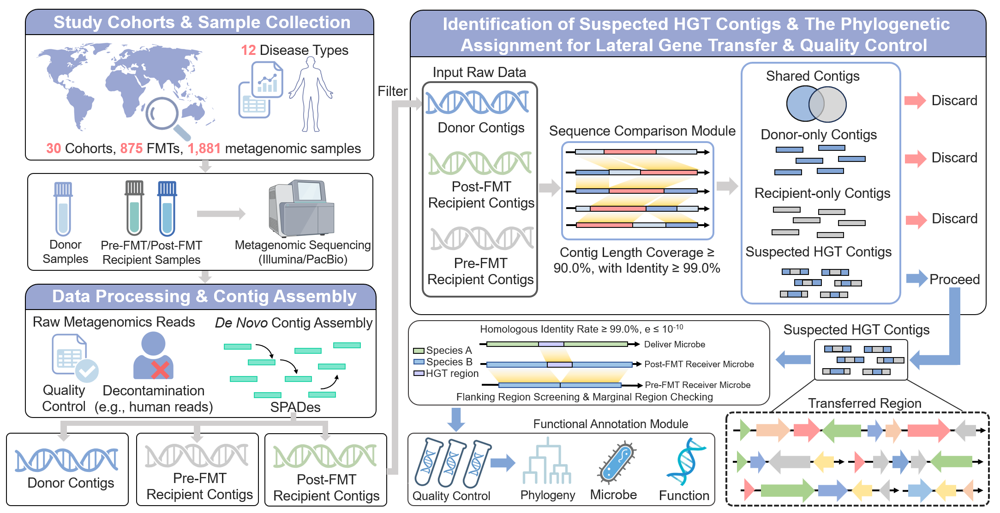
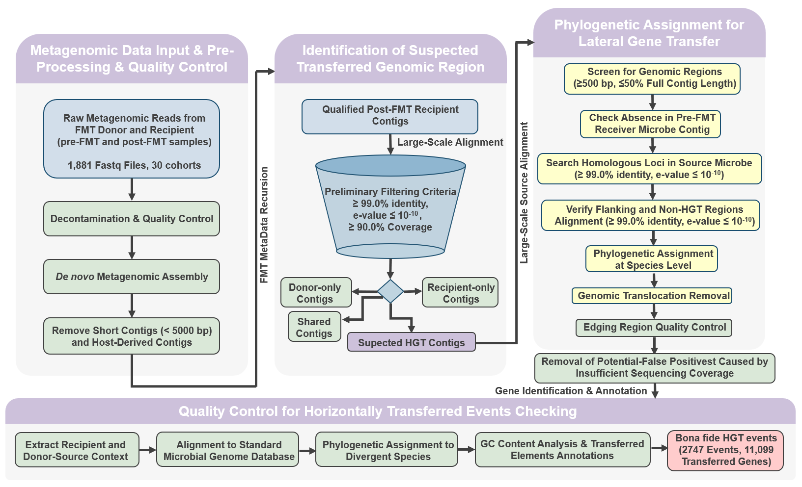

# Fecal_Microbiota_Transplantation_HGT_Project

This pipeline identifies putative horizontal gene transfer (HGT) events from longitudinal metagenomic samples (pre‑FMT, donor, post‑FMT). It combines sequence alignment filtering, taxonomic assignment, gene prediction, functional annotation, and curation steps that remove false positives potentially caused by assembly edge effects and other possible factors.

## Requirements
### System Dependencies
- Python 3.9+ with packages: pandas, openpyxl, biopython

- BLAST+ (makeblastdb, blastn)

- Prodigal (gene prediction)

- eggNOG‑mapper (emapper.py) and its diamond dependency

- Kraken2 and Taxonkit (species assignment)

- seqtk (optional, for faster FASTA extraction)

- Standard Unix tools: awk, sed, sort, paste, mkdir

## Core Framework of the Pipeline

To systematically identify HGT events driven by FMT, we developed HGTector, a computational framework that integrates metagenomic assembly, homology search, phylogenetic assignment, and functional annotation (as shown above). Briefly, raw metagenomic reads from donor and recipient (pre‑FMT and post‑FMT) samples were subjected to de-contamination and de novo metagenomic assembly, followed by rigorous quality control and decontamination to remove potential contaminants.

### Notes: 

when processing long-reads sequencing data, please revise ./root.sh in line 231 pf HGT_main_implementing.sh as ./root1.sh
