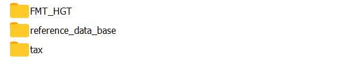
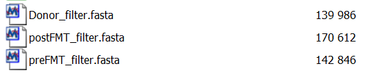
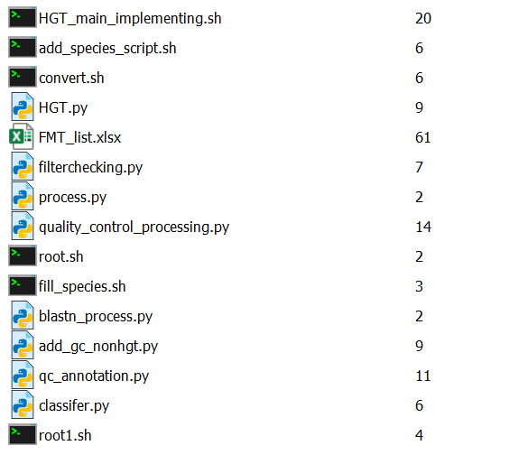
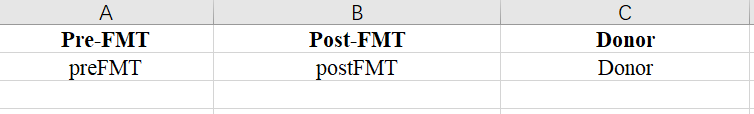
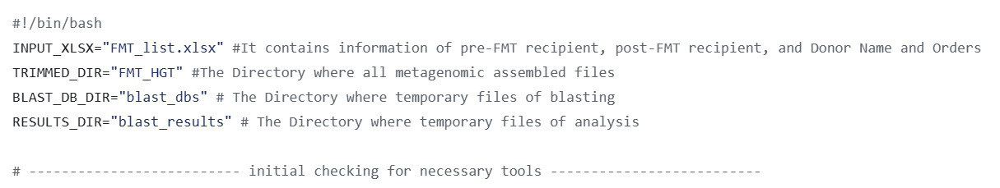
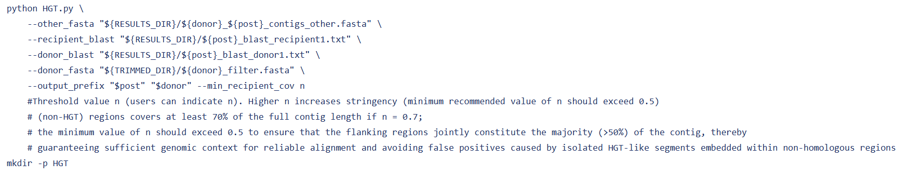

# Fecal_Microbiota_Transplantation_HGT_Project

This pipeline identifies putative horizontal gene transfer (HGT) events from longitudinal metagenomic samples (pre‑FMT, donor, post‑FMT). It combines sequence alignment filtering, taxonomic assignment, gene prediction, functional annotation, and curation steps that remove false positives potentially caused by assembly edge effects and other possible factors.

## Requirements
### System Dependencies
- Python 3.9+ with packages: pandas, openpyxl, biopython

- BLAST+ (makeblastdb, blastn)

- Prodigal (gene prediction)

- eggNOG‑mapper (emapper.py) and its diamond dependency

- Kraken2 and Taxonkit (species assignment)

- seqtk (optional, for faster FASTA extraction)

- Standard Unix tools: awk, sed, sort, paste, mkdir

## Core Framework of the Pipeline

- To systematically identify HGT events driven by FMT, we developed HGTector, a computational framework that integrates metagenomic assembly, homology search, phylogenetic assignment, and functional annotation (as shown above). 

- Briefly, raw metagenomic reads from donor and recipient (pre‑FMT and post‑FMT) samples were subjected to de-contamination and de novo metagenomic assembly, followed by rigorous quality control and decontamination to remove potential contaminants.

### Notes: 
- Please appropriately assign the corresponding path of directory containing assembled FMT contig files (e.g. pre-FMT recipient, post-FMT recipient, and Donor contig files), FMT metadata reference, taxonomic database, and gene annotation reference database in the corresponding file (e.g. HGT_main_implementing.sh, qc_annotation.py, convert.sh, and etc.). Full details are available in annotations of each computational script;

- For user who attempt to process long-reads sequencing data (e.g. PacBio type) by HGTector, please revise "./root.sh" in line 253 of HGT_main_implementing.sh as "./root1.sh";

- Please feel free to contact us via Chen2422679942@163.com and we are willing to provide necessary assistance for implementing HGTector.

### A Prelimnary Step-by-step Example

In your initial path, you have 3 different directories named as __"FMT_HGT"__, __"tax"__, and __"reference_data_base"__, as shown below:

Metagenomic Assembled Files (pre-FMT recipient, post-FMT recipient, and Donor) are deposited in __"FMT_HGT"__, with phylogenetic annotation files contained in __"tax"__ and __"reference_data_base"__, respectively. In __"FMT_HGT"__, we have 3 metagenomic assembled files (as shown below), with contigs < 5000 bp filtered.

In linux system, the necessary components in __"tax"__ can be downloaded via:

- wget -c https://ftp.ncbi.nih.gov/pub/taxonomy/taxdump.tar.gz
- tar -zxvf taxdump.tar.gz

The necessary components in __"reference_data_base"__ can be prepared by following the guideline at https://benlangmead.github.io/aws-indexes/k2

After all basic files prepared as aforementioned, we can start to use HGTector directly.

First, please make sure that all scripts in this GitHub inventory have been appropriately put in your current user directory path, like the following:

Here, the __"FMT_list.xlsx"__ contains FMT order information for HGTector to understanding the longitudinal information of each FMT sample (__preFMT__, __postFMT__, and __Donor__ refers to prefix of __preFMT_filter.fasta__, __postFMT_filter.fast__, and __Donor_filter.fasta__, respectively). The content of it is similar to the format shown below:

In next step, users can open the script of __HGT_main_implementing.sh__ for more details and information.

__HGT_main_implementing.sh__ is the script serves as the entry point and workflow manager for manipulating the entire HGTector.

In this script, lines 1-6 shows the corresponding directory for __"FMT_HGT"__, __"FMT_list.xlsx"__, and intermediate processing directory path (as shown below). Please define the appropriate path for any user-customized conditions.

__HGT_main_implementing.sh__ call modules or scripts of blastn, blastn_process.py, classifer.py, HGT.py, prodigal, emapper.py, qc_annotation.py, convert.sh, add_species_script.sh, root.sh, fill_species.sh, add_gc_nonhgt.py, filterchecking.py, quality_control_processing.py, etc. Each of the script has unique functions and full annotations of these scripts have been available in the corresponding script and the appropriate loaction in __HGT_main_implementing.sh__.

Before utilization of HGTector, please pay attention to lines 170-173 in __HGT_main_implementing.sh__, and assign a user-customized parameter n to --min_recipient_cov. We have provided full information and reference regarding the selection of n in annotation part. In any kind of condition, n ≥ 0.5 (n < 1) should be maintained, with exact reasons available in the corresponding annottaion parts in scripts.

Then, please open scripts of __convert.sh__, and __add_species_script.sh__ to indicate the exact directory path for the aforementioned __"tax"__, and __"reference_data_base"__, so that these scripts can smoothly function as wished.

Lastly, implement HGTector by inputting commands of "nohup ./HGT_main_implementing.sh &", and the HGTector will automatically run.
